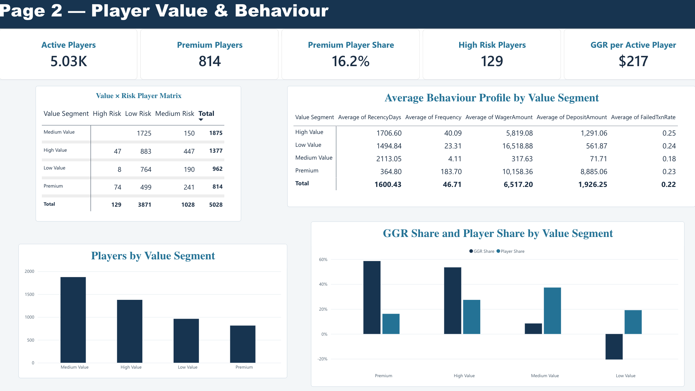

# Player Analytics on Online Gambling Activity

**467,020 rows** of real player activity across six workbooks: 327,395 payment
attempts and 134,594 player-days of play, from 5,028 players followed for six
years, 2015 to 2021.

Model it into one table, aggregate it, segment the players by value and by
risk, build a review workflow for the ones that need a human, and put a
dashboard on top.

The six years matter more than the row count. This is a panel, not a snapshot:
the same people tracked forward, which is the only reason the cohort effects
below are visible at all.

The activity behind this is real operator data from the online gambling sector,
not generated for a tutorial. The operator is not identified here, the source
workbooks are not redistributed, and the data carries no names, emails,
addresses or account numbers: players appear only as surrogate ids.

`src/make_sample_data.py` generates synthetic workbooks at the same scale, with
the same sheet names, columns and types, so every script below runs end to end
on a clean clone.

## The data

Six workbooks, one row per event:

| Table | Grain | Columns |
| --- | --- | --- |
| Demographics | one player | UserID, DateOfBirth, Gender, CountryCode |
| Country reference | one country | CountryCode, Country |
| Games | one player-day of cash games | UserID, Date, CashGames, Odds, Wagers, Winnings |
| Tournaments | one player-day of tournaments | UserID, Date, Tournaments, Odds, Wagers, Winnings |
| Deposits | one deposit attempt | UserID, DepositID, Date, Time, PayMeth, PayMethCat, Amount, Status |
| Withdrawals | one withdrawal attempt | UserID, WithdrawalID, Date, Time, PayMeth, PayMethCat, Amount, Status |

Deposits and withdrawals arrive split across separate successful and failed
sheets, so failed attempts have to be carried through rather than dropped: a
high failure rate is itself a signal.

The origin is real, but the file is not a raw extract. The age distribution does
not look like a real market of this size, so the data has likely been resampled
or otherwise processed before publication. Nothing below depends on the age mix
being representative, but reading this as a market snapshot would be a mistake.

Data model: [`docs/er_diagram.md`](docs/er_diagram.md).
Findings from the original data: **[`docs/findings.md`](docs/findings.md)**.

## What it does

**1. Combine everything into one player-day table.** Five sources at three
different grains. Play activity is already daily, transactions are timestamped
and need aggregating, demographics are static. The join has to keep a player-day
that has a deposit but no play, and one that has play but no deposit.

**2. Aggregate to month by game type.** Player volume, total wagers, total
winnings and average odds, cash games against tournaments. Average odds is
averaged per player-day first and then across the month, because averaging
across raw rows weights heavy players more than the question intends.

**3. Build an anti-money-laundering review file.** A player-level workbook with
locked columns, dropdown validation on Review Status and Decision, and a free
text comment field. The script then reads a returned workbook back, validates
what the reviewer entered against the allowed values, and exports a CSV replica.
The point is that the reviewer's decision is captured in a structured,
checkable form rather than in an email.

**4a. Segment the players by value.** Two approaches kept side by side: KMeans
on five standardised features (Recency, Frequency, Monetary, Deposit, Tenure),
and a classic RFM score. Segments are Low, Medium, High and Premium.

The features are log-transformed first, because deposit and wager amounts span
several orders of magnitude and KMeans minimises squared distance. Monetary uses
`signed_log1p`, because net gaming can be negative: a plain `log1p` is undefined
for a player who won more than they staked, and those are exactly the players
that turn out to matter.

KMeans is written out in numpy, k-means++ initialisation included, rather than
called from a library. **K=4 is a business choice and the diagnostics say so.**
The mean silhouette stays near 0.2 across K=2 to K=8, a range of about 0.04, so
no K separates these players cleanly and the metric cannot decide this. K=2
would be too coarse to act on, so four tiers are chosen because four tiers map
to four different treatments. Per-K figures are in the `KMeans_Diagnostics`
sheet of `output/player_segments.xlsx`.

Keeping the RFM result beside KMeans matters: the two methods disagree on some
players, and the disagreement marks where the boundary is soft.

**4b. Score the players for risk.** Two independent scores, not one combined
flag, because they call for different responses: anti-money-laundering is an
investigation, responsible gambling is an intervention. Collapsing them into a
single number would make a payments pattern and a harm marker cancel out or
reinforce each other, and neither is meaningful.

AML triggers, financial-crime typologies:

| Trigger | Condition | Points |
| --- | --- | ---: |
| Pass-through | deposit ≥ 5,000, playthrough < 10%, withdrawal/deposit ≥ 80% | 3 |
| Withdrawal with no deposit | deposit = 0 and withdrawal > 0 | 3 |
| Withdrawal exceeds deposit | deposit ≥ 2,000 and withdrawal/deposit ≥ 1.50 | 2 |
| Card testing | ≥ 10 failed deposits and ≥ 50% failure rate | 2 |
| Large withdrawal volume | withdrawal in the top 1% | +1, **only on top of another trigger** |

Responsible-gambling triggers, markers of harm:

| Trigger | Condition | Points |
| --- | --- | ---: |
| Loss chasing | ≥ 10 days depositing again after a losing session | 2 |
| Deposit escalation | deposits ≥ 2× the earlier baseline, tenure ≥ 180 days | 2 |
| High loss velocity | net loss per active day in the top 5% | 2 |
| Sustained intensity | ≥ 30 consecutive active days | 1 |
| High absolute loss | net gaming loss in the top 5% | 1 |

Tiering is an OR across the two scores, never a sum: **High Risk at AML ≥ 3 or
RG ≥ 4, Medium at AML ≥ 1 or RG ≥ 2.** Three AML points and four RG points mean
different things and must not trade against each other.

Three design decisions worth naming:

- **Volume alone never creates risk.** The large-withdrawal point is a severity
  multiplier that only applies when a pattern already fired. Without that guard
  the rule would flag the biggest customers for being big, which is the most
  common way a risk model becomes unusable in practice.
- **Absolute thresholds for typologies, percentiles for intensity.** Pass-through
  and card testing describe a specific behaviour, so they use fixed numbers that
  mean the same thing on any dataset. Loss velocity and absolute loss ask
  "unusual compared with these players", so they use percentiles of this
  population. Using one kind of threshold for both would get one of them wrong.
- **Escalation requires 180 days of tenure.** A new player has no baseline to
  escalate from, so without the gate every new depositor would look like a
  worsening one.

**5. Build the dashboard.** Three pages: business performance, player value and
behaviour, and payments and review indicators. The five-page structure in
[`docs/dashboard_design.md`](docs/dashboard_design.md) is the design; what is
built is a condensed version of it. Screenshots in
[`docs/dashboard/`](docs/dashboard).

The review queue on page 3 is the one worth opening. It carries a Risk Driver
column separating AML from Responsible Gambling, so two players at the same risk
tier are visibly there for different reasons and route to different responses.



## Four findings

Full write-up with the charts: [`docs/findings.md`](docs/findings.md).

**The declining trend is attrition, not demand.** Wagers fall from 17.5M in 2015
to almost nothing by 2021, but this is a fixed cohort followed forward. Nobody
joins after the start, so every later year holds only the players who had not
stopped yet. A falling line here measures churn, and reading it as a shrinking
market would point at the wrong problem.

**High volume is not high value.** Low Value players have the highest average
wager of any segment, 16,519 against Premium's 10,158. They are low value
because they win: their contribution to revenue is negative. Ranking players by
volume would rank this group first, which is exactly backwards.

**Risk sits inside the revenue.** 129 players are flagged High Risk, and 121 of
them are Premium or High Value. An automatic restriction would land almost
entirely on the most valuable players, which is why review is a workflow with a
human decision rather than a filter.

**Deposits and withdrawals pull apart.** Both start near 72% success in 2015. By
2020 deposits reach 81% while withdrawals fall to 38%. One line rising while the
other falls is not general payment health, it points at the withdrawal path
specifically. And since failed transaction rate feeds the risk score, a
processing problem can surface as a behavioural signal.

## Run it

```bash
pip install -r requirements.txt
python -m src.make_sample_data    # synthetic source workbooks -> data/
python src/run_sql.py             # player-day and monthly tables -> output/
python src/build_aml_review.py    # AML review workbook + validation -> output/
python src/segment_players.py     # value and risk segments -> output/
```

Sample outputs from a synthetic run are committed under `output/` for the small
files. The large intermediate tables and the DuckDB file are rebuilt rather than
tracked.

## Scope and limits

The first version was built against a two-day brief, and that shows in where the
depth is. The modelling, the segmentation and the review workflow are finished.
The analysis was later written up properly in
[`docs/findings.md`](docs/findings.md), which is where most of the reasoning
lives now.

What is deliberately not here:

- **The game-mix shift is described, not explained.** Cash games are 92% of
  wagers in 2015 and tournaments are 100% by 2021. Separating survivorship from
  genuine behaviour change needs a per-player time series, which is a next step
  rather than a finding.
- **Withdrawal failures are not broken down by cause.** The success rate halves
  over the period, but the source tables carry no failure reason, so the finding
  stops at "ask the payments team".
- **The risk rules are reasonable, not evaluated.** There are no known outcomes
  to validate them against, so they are rules with a rationale rather than a
  model with a measured precision and recall. That distinction is kept visible
  on purpose.
- **The two segmentation methods are not reconciled player by player.** They
  disagree on some players, and the disagreement is informative, but comparing
  them properly has not been done.

## Notes on judgment

**Risk labels are for prioritising review, not for accusing anyone.** A high
risk segment means a person should look, not that misconduct occurred. The AML
workbook is built the same way: it routes a case to a reviewer and records the
reviewer's decision.

**GGR is a regulated term, so the number is reported as an estimate.** Wagers
minus winnings is a defensible calculation, but Gross Gaming Revenue has a
specific definition in each jurisdiction and is not claimed here. Page 1 of the
dashboard labels it Estimated GGR throughout. Page 2 shortens that to GGR in the
two places where a KPI card cannot hold the longer label; the measure behind
both is the same.

**Failed transactions are kept.** They are loaded from their own sheets and
carried into the player-day table, because failure rate feeds the risk
indicators.

## Stack

Python, DuckDB, pandas, numpy, openpyxl, Power BI for the dashboard. No modelling library: the clustering is written out.
