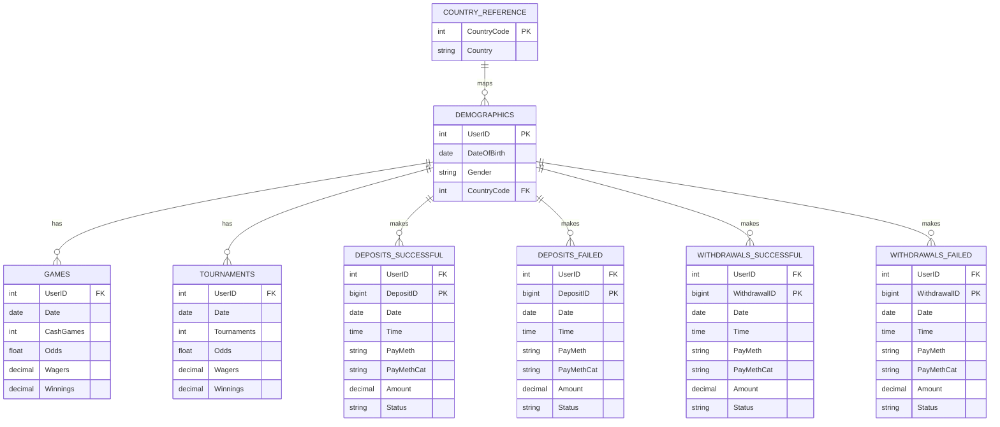

# Source data model

## Relationship notes

- `CountryReference.CountryCode` is the lookup key for `Demographics.CountryCode`.
- `Demographics.UserID` is the main entity key for user-level analysis.
- `Games` and `Tournaments` are behavioral fact tables; one user can have many rows per day.
- `Deposits` and `Withdrawals` are financial fact tables; each row represents one transaction.
- `Status` distinguishes successful vs failed transactions and should be retained during aggregation.
- The final Q1 table should be built at `UserID + ActivityDate` grain, after daily aggregation of each fact table.
