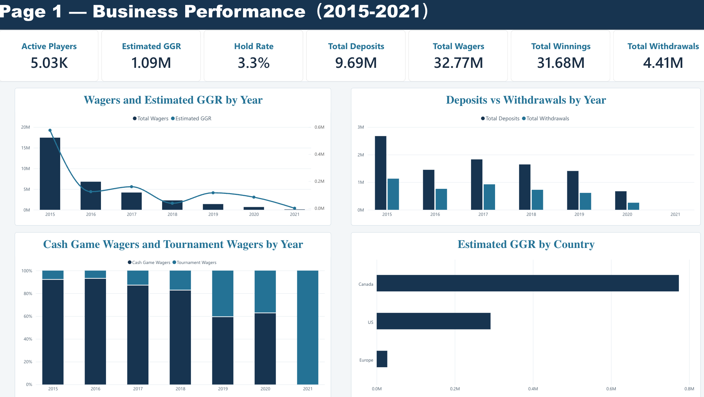
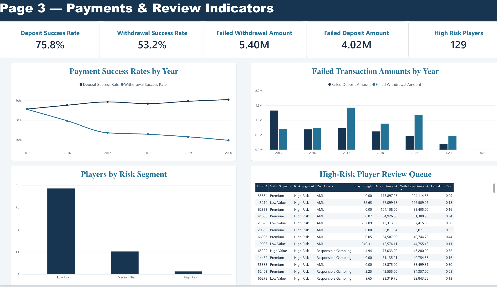

# Findings

Five thousand players followed from 2015 to 2021, with their play, deposits and
withdrawals. These are the results from the original dataset, read off the
dashboard built on it. The repository ships synthetic data instead, so a clone
reproduces the pipeline but not these specific numbers.

Headline figures: 5,028 players, 32.77M in wagers, 31.68M in winnings, 1.09M in
estimated gross gaming revenue, a 3.3% hold rate, and 217 dollars of revenue per
active player.

---

## 1. Read the time axis before reading the trend

Wagers fall from 17.5M in 2015 to almost nothing in 2021. That looks like a
business collapsing. It is not.

This is a **fixed cohort**: the same group of players, followed forward. Nobody
new joins after the start. So every later year contains only the people who had
not yet stopped playing. A declining line in a fixed cohort measures attrition,
not market demand, and the two call for completely different responses.

The same caution applies to the 2021 column everywhere on the dashboard. It is a
partial year, so any year-over-year comparison that includes it is comparing a
full year against a fragment.

**The chart is correct. The reading of it is where the mistake would be.**

## 2. The game mix inverts

In 2015, cash games are 92% of wagers. By 2021, tournaments are 100%.

This is not a slow drift. The crossover lands between 2018 and 2019, and once it
flips it does not come back. Two readings fit, and the data here cannot separate
them:

- The players who stayed are the ones who prefer tournaments, so the mix shifted
  because the population shifted.
- Individual players moved from cash games to tournaments as they aged in.

The difference matters. The first is survivorship and needs no action. The second
is a behaviour change and may need a product response. Separating them needs a
per-player view over time, which is a next step rather than a finding.

## 3. High volume is not high value, and the gap is where the risk sits

| Value segment | Players | Avg wager | Avg deposit | Avg frequency | Share of revenue |
| --- | ---: | ---: | ---: | ---: | ---: |
| Premium | 814 | 10,158 | 8,885 | 183.7 | about 59% |
| High Value | 1,377 | 5,819 | 1,291 | 40.1 | about 54% |
| Medium Value | 1,875 | 318 | 72 | 4.1 | about 9% |
| Low Value | 962 | **16,519** | 562 | 23.3 | **about −20%** |

Two things in that table are worth stopping on.

**Low Value players wager more than anyone, including Premium.** Average wager
of 16,519 against Premium's 10,158. They are not low value because they play
little. They are low value because they win: their contribution to revenue is
negative. Ranking players by volume would put this group at the top, and it
would be exactly backwards.

**Sixteen percent of players produce around 59% of revenue.** Premium is 814
people out of 5,028.

## 4. Risk concentrates in the players worth the most

129 players are flagged High Risk, 2.6% of the base. They are not spread evenly:

| Value segment | High Risk players |
| --- | ---: |
| Premium | 74 |
| High Value | 47 |
| Low Value | 8 |
| Medium Value | 0 |

**121 of the 129 sit in the two segments that generate most of the revenue.**

That is the uncomfortable part, and it is the reason the review workflow exists
as a workflow rather than as a filter. An automatic restriction on High Risk
would land almost entirely on the most valuable players, so the decision has to
be made by a person, with the evidence in front of them and the decision
recorded.

The review queue separates the two drivers it was built to tell apart: anti
money laundering patterns, and responsible gambling concerns. They need
different responses and should not share a single flag.

## 5. Withdrawals succeed less and less, while deposits succeed more

The clearest operational finding on the dashboard:

| Year | Deposit success | Withdrawal success |
| --- | ---: | ---: |
| 2015 | about 72% | about 72% |
| 2017 | about 79% | about 46% |
| 2020 | about 81% | about 38% |

They start together and then split apart. Deposits improve. Withdrawals halve.
Over the period, 5.40M of withdrawals failed against 4.02M of deposits, even
though total withdrawals are less than half of total deposits.

The split is the signal. Payment processing that was getting better overall
would lift both lines. One line rising while the other falls points at something
specific to the withdrawal path: tightening checks, a failing provider, or a
change in what customers are attempting. Which one it is cannot be settled from
these tables, and that is the first thing worth asking the payments team.

**This matters beyond operations.** A failed withdrawal is a customer who tried
to take their own money out and could not. Failed transaction rate is already an
input to the risk score, so a processing problem can look like a behavioural
signal, and a player can be flagged for something the platform did.

---

## What would come next

- Separate the game-mix shift into survivorship against genuine behaviour change,
  with a per-player time series.
- Break down withdrawal failures by payment method and failure reason, which the
  source tables do not carry.
- Compare the two segmentation methods player by player. The clustering and the
  RFM score disagree on some players, and the disagreement marks where the
  boundary is soft rather than where one method is wrong.
- Validate the risk rules against known outcomes. Right now they are reasonable
  rules, not evaluated ones, and that distinction should stay visible.
